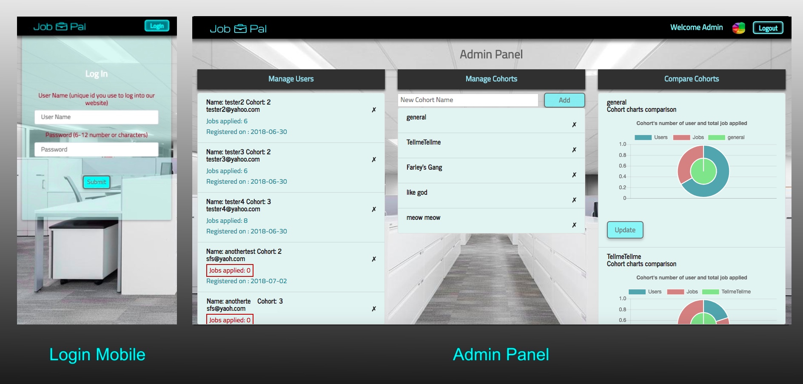

# Jobpal

### build a react version of JobPal
This Site aids users in their job hunting process by providing tracking & data visualization tools. 

### Technologe used
1. reactjs
2. express
3. mysql
4. body-parser
5. axios
6. passport
7. passport-local
8. express session
9. bcrypt
10. sweetalert
11. chart js
12. react-router-dom
13. react-responsive-modal
 
### Screen Shots




### Deployment Notes
1. set the port on server.js to
```js
const PORT = process.env.PORT || 8080;
```
2. Run this command in your Terminal/Bash window:

    * `heroku addons:create jawsdb`

    * This command will add the free jawsdb mysql database to your project.

## Learning points

```js
//git heroku related commands
git remote rm heroku
heroku git:remote -a newname
heroku create
git remote -v
heroku apps:rename abcdefg
heroku addons:create jawsdb
heroku config:get JAWSDB_URL
heroku logs -t
```


```js
// react router usage example need to use <Link> for all nav bar
const App = () => (
  <Router>
    <div>
      <Nav />
      <Switch>
        <Route exact path="/" component={Landing} />
        <Route exact path="/Login" component={Login} />
        <Route component={NoMatch} />
      </Switch>
    </div>
  </Router>
);

export default App;
```

```js
//formbtn example
import React from "react";

export const FormBtn = props => (
  <button {...props} style={{ float: "right", marginBottom: 10 }} className="btn btn-success">
    {props.children}
  </button>
);

```

```js
//es6 template literal and map example 
<div>
    {this.state.notes.map(note => (
    <li key={note._id}>
        <h6>{`${note.title} says:` }</h6>
        <span>{note.body}</span>
    </li>
    ))}
</div>
```


## Link to the site
[https://jobpal.herokuapp.com](https://jobpal.herokuapp.com)


## Author 
[Kitty Shen ](https://github.com/kittyshen)

https://github.com/kittyshen

### [Link to Portfolio Site](https://kittyshen.github.io/Portfolio/)
[www.kittykuma.com](http://www.kittykuma.com)

## Acknowledgments
This project is a advanced react redesign version over group project 2
* [https://jobobo-flow.herokuapp.com/](https://jobobo-flow.herokuapp.com/)
* [https://github.com/alexgood1/Joboboflow](https://github.com/alexgood1/Joboboflow)

### License
Standard MIT License
